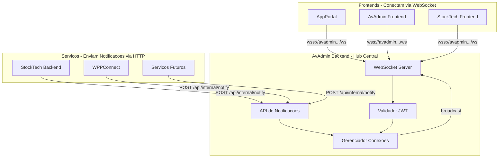

# WebSocket Hub Centralizado no AvAdmin

Migracao completa do WebSocket Server do StockTech para o AvAdmin Backend (FastAPI), criando um hub central de notificacoes para todo o sistema AvelarSys.

---

## Arquitetura Final



---

## Fase 1: Criar WebSocket Server no AvAdmin Backend

### 1.1 Criar modulo WebSocket

**Criar diretorio:** `AvAdmin/backend/app/websocket/`

Arquivos a criar:

- `__init__.py` - Exports do modulo
- `manager.py` - ConnectionManager (gerenciador de conexoes)
- `routes.py` - Endpoint WebSocket `/ws`
- `models.py` - Schemas e tipos de notificacao

### 1.2 ConnectionManager (manager.py)

```python
class ConnectionManager:
    active_connections: Dict[str, WebSocket]  # client_id -> websocket
    
    async def connect(websocket, user_id, account_id)
    async def disconnect(client_id)
    async def send_to_user(user_id, account_id, message)
    async def broadcast_to_account(account_id, message)
    async def broadcast_all(message)
    def get_stats() -> dict
```

### 1.3 Tipos de Notificacao (models.py)

Manter compatibilidade com tipos existentes:

```python
class NotificationType(str, Enum):
    CONNECTION_ESTABLISHED = "connection_established"
    ORDER_CREATED = "order_created"
    PAYMENT_CONFIRMED = "payment_confirmed"
    ORDER_UPDATED = "order_updated"
    STOCK_ALERT = "stock_alert"
    CART_UPDATED = "cart_updated"
    PRODUCT_ADDED = "product_added"
    PRODUCT_UPDATED = "product_updated"
    PRODUCT_DELETED = "product_deleted"
    TRANSACTION_CREATED = "transaction_created"
    PROFILE_UPDATED = "profile_updated"
```

### 1.4 Rota WebSocket (routes.py)

- Endpoint: `GET /ws?token=xxx`
- Validar token via `security.verify_token()`
- Buscar usuario e conta no banco
- Registrar conexao no ConnectionManager
- Heartbeat a cada 30 segundos

---

## Fase 2: Criar API REST para Notificacoes

### 2.1 Adicionar endpoint em internal_api.py

**Arquivo:** [AvAdmin/backend/app/routes/internal_api.py](AvAdmin/backend/app/routes/internal_api.py)

```python
@router.post("/notify")
async def send_notification(request: NotificationRequest):
    """
    Envia notificacao via WebSocket para usuario(s)
    Uso: StockTech e outros servicos chamam este endpoint
    """
```

### 2.2 Schema NotificationRequest

```python
class NotificationRequest(BaseModel):
    type: str  # Tipo da notificacao
    title: str
    message: str
    data: Optional[dict] = None
    
    # Destino (pelo menos um obrigatorio):
    user_id: Optional[str] = None       # Usuario especifico
    account_id: Optional[str] = None    # Broadcast para conta
    user_ids: Optional[List[str]] = None # Multiplos usuarios
```

### 2.3 Endpoint de estatisticas

```python
@router.get("/ws-stats")
async def get_websocket_stats():
    """Retorna estatisticas de conexoes ativas"""
```

---

## Fase 3: Integrar WebSocket no FastAPI

### 3.1 Atualizar main.py

**Arquivo:** [AvAdmin/backend/app/main.py](AvAdmin/backend/app/main.py)

```python
from app.websocket.routes import websocket_router

# Adicionar rota WebSocket
app.include_router(websocket_router)
```

### 3.2 Atualizar requirements.txt

**Arquivo:** [AvAdmin/backend/requirements.txt](AvAdmin/backend/requirements.txt)

Adicionar:

```
websockets==12.0
```

### 3.3 Atualizar CORS (se necessario)

Garantir que WebSocket aceita conexoes dos dominios:

- `stocktech.avelarcompany.com.br`
- `app.avelarcompany.com.br`
- `avadmin.avelarcompany.com.br`

---

## Fase 4: Refatorar StockTech Backend

### 4.1 Criar notification-client.ts

**Novo arquivo:** `StockTech/server/_core/notification-client.ts`

Cliente HTTP para enviar notificacoes ao AvAdmin:

```typescript
class NotificationClient {
  private avAdminUrl: string;
  
  async notify(params: NotificationParams): Promise<void>;
  
  // Metodos de conveniencia (mesma interface atual):
  notifyOrderCreated(buyerId, sellerId, accountId, orderData);
  notifyPaymentConfirmed(buyerId, sellerId, accountId, orderData);
  notifyOrderStatusUpdated(userId, accountId, orderData, status);
  notifyStockAlert(sellerId, accountId, productData);
  notifyProductAdded(sellerId, accountId, productData);
  notifyProductUpdated(sellerId, accountId, productData);
  notifyProductDeleted(sellerId, accountId, productData);
  notifyCartUpdated(userId, accountId, cartData);
  notifyTransactionCreated(userId, accountId, transactionData);
  notifyProfileUpdated(userId, accountId, profileData);
}
```

### 4.2 Depreciar websocket.ts

**Arquivo:** [StockTech/server/_core/websocket.ts](StockTech/server/_core/websocket.ts)

- Marcar como `@deprecated`
- Redirecionar chamadas para `notification-client.ts`
- Remover inicializacao do WebSocket Server local

### 4.3 Atualizar routers

**Arquivos a modificar:**

- [StockTech/server/routers.ts](StockTech/server/routers.ts)
- [StockTech/server/routers-updated.ts](StockTech/server/routers-updated.ts)
- [StockTech/server/routers/orders.ts](StockTech/server/routers/orders.ts)

Trocar:

```typescript
// ANTES
import { wsManager } from './_core/websocket';
wsManager.notifyProductAdded(...)

// DEPOIS
import { notificationClient } from './_core/notification-client';
notificationClient.notifyProductAdded(...)
```

### 4.4 Remover WebSocket do server/index.ts

**Arquivo:** `StockTech/server/index.ts`

Remover:

```typescript
wsManager.init(server);
```

---

## Fase 5: Atualizar Frontends

### 5.1 StockTech Frontend

**Arquivo:** [StockTech/client/src/hooks/useWebSocket.ts](StockTech/client/src/hooks/useWebSocket.ts)

Mudar URL de conexao:

```typescript
// ANTES
const wsUrl = `${protocol}//${window.location.host}/ws?token=...`

// DEPOIS
const WS_URL = import.meta.env.VITE_WS_URL || 'wss://avadmin.avelarcompany.com.br/ws'
const wsUrl = `${WS_URL}?token=${encodeURIComponent(token)}`
```

### 5.2 AppPortal Frontend

**Arquivo:** [AppPortal/src/hooks/useWebSocket.tsx](AppPortal/src/hooks/useWebSocket.tsx)

```typescript
// ANTES
const baseUrl = process.env.NEXT_PUBLIC_WS_URL || `${protocol}//${window.location.host}/ws`

// DEPOIS
const WS_URL = process.env.NEXT_PUBLIC_WS_URL || 'wss://avadmin.avelarcompany.com.br/ws'
const wsUrl = `${WS_URL}?token=${encodeURIComponent(token)}`
```

### 5.3 AvAdmin Frontend

**Arquivo:** [AvAdmin/frontend/src/hooks/useWebSocket.tsx](AvAdmin/frontend/src/hooks/useWebSocket.tsx)

```typescript
// ANTES
const baseUrl = process.env.NEXT_PUBLIC_WS_URL || `${protocol}//${window.location.host}/ws`

// DEPOIS (conexao local - mesmo dominio)
const WS_URL = process.env.NEXT_PUBLIC_WS_URL || `${protocol}//${window.location.host}/ws`
const wsUrl = `${WS_URL}?token=${encodeURIComponent(token)}`
```

---

## Fase 6: Configurar Variaveis de Ambiente

### 6.1 StockTech (.env)

**Arquivo:** `StockTech/.env`

```bash
# WebSocket Hub (AvAdmin)
VITE_WS_URL=wss://avadmin.avelarcompany.com.br/ws

# AvAdmin API (para notificacoes)
AVADMIN_API_URL=https://avadmin.avelarcompany.com.br
```

### 6.2 AppPortal (.env.local)

**Arquivo:** `AppPortal/.env.local`

```bash
# WebSocket Hub (AvAdmin)
NEXT_PUBLIC_WS_URL=wss://avadmin.avelarcompany.com.br/ws
```

### 6.3 AvAdmin Backend (.env)

**Arquivo:** `AvAdmin/backend/.env`

```bash
# WebSocket Config
WS_HEARTBEAT_INTERVAL=30
WS_MAX_CONNECTIONS=1000
```

### 6.4 Desenvolvimento Local

Para desenvolvimento local, usar:

```bash
# StockTech
VITE_WS_URL=ws://localhost:8000/ws
AVADMIN_API_URL=http://localhost:8000

# AppPortal
NEXT_PUBLIC_WS_URL=ws://localhost:8000/ws

# AvAdmin Frontend (mesmo dominio)
NEXT_PUBLIC_WS_URL=ws://localhost:8000/ws
```

---

## Fase 7: Testes e Validacao

### 7.1 Testes Unitarios (AvAdmin Backend)

**Arquivo:** `AvAdmin/backend/tests/test_websocket.py`

```python
# Testar:
- Conexao WebSocket com token valido
- Rejeicao de conexao com token invalido
- Envio de notificacao para usuario
- Broadcast para conta
- Heartbeat e reconexao
- Estatisticas de conexoes
```

### 7.2 Testes de Integracao

```bash
# 1. Iniciar AvAdmin Backend
cd AvAdmin/backend && uvicorn app.main:app --reload

# 2. Conectar via WebSocket (wscat)
wscat -c "ws://localhost:8000/ws?token=TOKEN_VALIDO"

# 3. Testar envio de notificacao via API
curl -X POST http://localhost:8000/api/internal/notify \
  -H "Content-Type: application/json" \
  -d '{
    "type": "product_added",
    "title": "Teste",
    "message": "Produto de teste adicionado",
    "user_id": "USER_ID",
    "account_id": "ACCOUNT_ID"
  }'
```

### 7.3 Testes E2E

1. Abrir StockTech no navegador
2. Verificar conexao WebSocket (DevTools > Network > WS)
3. Criar produto e verificar notificacao
4. Criar pedido e verificar notificacoes para comprador/vendedor

### 7.4 Checklist de Validacao

- [ ] WebSocket conecta com token valido
- [ ] WebSocket rejeita token invalido
- [ ] Notificacao chega ao usuario correto
- [ ] Broadcast funciona para toda a conta
- [ ] Reconexao automatica funciona
- [ ] Heartbeat mantem conexao viva
- [ ] Multiplas conexoes do mesmo usuario funcionam
- [ ] Estatisticas estao corretas

---

## Fase 8: Deploy e Migracao

### 8.1 Ordem de Deploy

1. **AvAdmin Backend** (primeiro - hub central)
2. **StockTech Backend** (segundo - envia notificacoes)
3. **Frontends** (por ultimo - conectam ao hub)

### 8.2 Deploy AvAdmin Backend

```bash
cd AvAdmin/backend

# Build Docker
docker build -t avadmin-backend:latest .

# Deploy (Docker Compose ou Kubernetes)
docker-compose up -d
```

### 8.3 Deploy StockTech Backend

```bash
cd StockTech

# Build
npm run build

# Deploy
pm2 restart stocktech-server
```

### 8.4 Deploy Frontends

```bash
# StockTech
cd StockTech && npm run build && npm run deploy

# AppPortal
cd AppPortal && npm run build && npm run deploy

# AvAdmin Frontend
cd AvAdmin/frontend && npm run build && npm run deploy
```

### 8.5 Rollback Plan

Se algo der errado:

1. **Reverter StockTech** para usar WebSocket local:

   - Restaurar `wsManager.init(server)` em `server/index.ts`
   - Reverter imports de `notification-client` para `wsManager`

2. **Frontends** conectam no dominio atual (fallback automatico)

### 8.6 Monitoramento Pos-Deploy

- Verificar logs do AvAdmin Backend
- Monitorar conexoes WebSocket ativas
- Verificar latencia de notificacoes
- Alertar se conexoes caem abruptamente

---

## Resumo de Arquivos

### Novos Arquivos (Criar)

| Arquivo | Descricao |

|---------|-----------|

| `AvAdmin/backend/app/websocket/__init__.py` | Exports do modulo |

| `AvAdmin/backend/app/websocket/manager.py` | ConnectionManager |

| `AvAdmin/backend/app/websocket/routes.py` | Endpoint WebSocket |

| `AvAdmin/backend/app/websocket/models.py` | Schemas e tipos |

| `StockTech/server/_core/notification-client.ts` | Cliente HTTP notificacoes |

### Arquivos a Modificar

| Arquivo | Modificacao |

|---------|-------------|

| `AvAdmin/backend/app/main.py` | Adicionar websocket_router |

| `AvAdmin/backend/app/routes/internal_api.py` | Adicionar /notify e /ws-stats |

| `AvAdmin/backend/requirements.txt` | Adicionar websockets==12.0 |

| `StockTech/server/_core/websocket.ts` | Depreciar ou remover |

| `StockTech/server/routers.ts` | Trocar wsManager por notificationClient |

| `StockTech/server/routers-updated.ts` | Trocar wsManager por notificationClient |

| `StockTech/server/routers/orders.ts` | Trocar wsManager por notificationClient |

| `StockTech/server/index.ts` | Remover wsManager.init() |

| `StockTech/client/src/hooks/useWebSocket.ts` | Atualizar URL |

| `AppPortal/src/hooks/useWebSocket.tsx` | Atualizar URL |

| `AvAdmin/frontend/src/hooks/useWebSocket.tsx` | Atualizar URL |

---

## Tempo Estimado

| Fase | Descricao | Tempo |

|------|-----------|-------|

| 1 | Criar WebSocket Server (AvAdmin) | 3h |

| 2 | API REST para Notificacoes | 1h |

| 3 | Integrar no FastAPI | 30min |

| 4 | Refatorar StockTech Backend | 2h |

| 5 | Atualizar Frontends | 1h |

| 6 | Variaveis de Ambiente | 30min |

| 7 | Testes e Validacao | 1.5h |

| 8 | Deploy e Migracao | 1h |

| **Total** | | **10-11h**