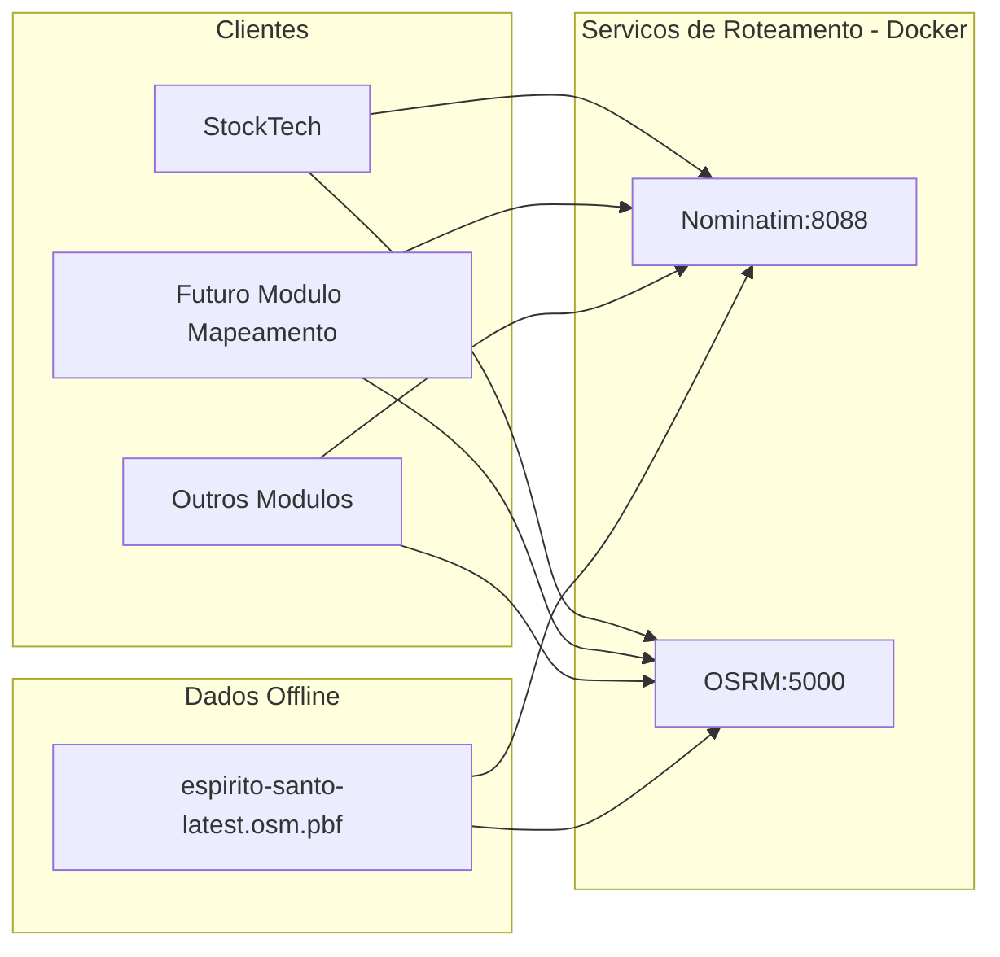

# Plano de Roteamento Real e Geocodificacao - Espirito Santo

## Objetivo

Implantar geocodificacao completa (endereco com numero para coordenadas) e roteamento real (distancia por estradas), usando mapas offline do Espirito Santo, com servicos rodando via Docker Compose. O StockTech e modulos futuros (como mapeamento) poderao consumir essas APIs internas.

## Arquitetura Proposta



## Componentes

### 1. Nominatim (Geocodificacao)

- **Funcao**: Converter endereco completo (Rua X, 123, Bairro Y, Cidade) em coordenadas (latitude/longitude)
- **Imagem Docker**: `mediagis/nominatim:4.4`
- **Porta**: 8088
- **Dados**: Mapa do ES em formato `.osm.pbf`
- **Requisitos de disco**: ~5-10GB para o ES
- **Requisitos de RAM**: 4-8GB recomendado

### 2. OSRM (Roteamento)

- **Funcao**: Calcular rota real entre duas coordenadas (distancia em km por estradas)
- **Imagem Docker**: `osrm/osrm-backend:latest`
- **Porta**: 5000
- **Dados**: Mapa do ES pre-processado
- **Requisitos de disco**: ~500MB-1GB processado
- **Requisitos de RAM**: 2-4GB

### 3. Mapa do Espirito Santo

- **Fonte**: Geofabrik (atualizado diariamente)
- **URL**: `https://download.geofabrik.de/south-america/brazil/espirito-santo-latest.osm.pbf`
- **Tamanho**: ~50-80MB
- **Atualizacao**: Diaria (pode configurar cron para baixar semanalmente)

## Estrutura de Arquivos

```
/home/avelarsys/AvelarSys/
├── docker-compose.yml          # Adicionar servicos nominatim e osrm
├── routing/
│   ├── data/                   # Dados do mapa
│   │   └── espirito-santo-latest.osm.pbf
│   ├── nominatim/              # Dados processados Nominatim
│   ├── osrm/                   # Dados processados OSRM
│   └── scripts/
│       ├── download-map.sh     # Script para baixar mapa atualizado
│       └── process-osrm.sh     # Script para processar mapa OSRM
```

## Docker Compose - Novos Servicos

```yaml
# Adicionar ao docker-compose.yml existente

services:
  # ... servicos existentes ...

  nominatim:
    image: mediagis/nominatim:4.4
    container_name: nominatim
    restart: unless-stopped
    ports:
      - "8088:8080"
    environment:
      - PBF_URL=https://download.geofabrik.de/south-america/brazil/espirito-santo-latest.osm.pbf
      - REPLICATION_URL=https://download.geofabrik.de/south-america/brazil/espirito-santo-updates/
      - NOMINATIM_PASSWORD=nominatim_secure_password
    volumes:
      - nominatim-data:/var/lib/postgresql/14/main
      - ./routing/data:/nominatim/data
    shm_size: 1g
    networks:
      - avelar-network

  osrm:
    image: osrm/osrm-backend:latest
    container_name: osrm
    restart: unless-stopped
    ports:
      - "5000:5000"
    volumes:
      - ./routing/osrm:/data
    command: osrm-routed --algorithm mld /data/espirito-santo-latest.osrm
    networks:
      - avelar-network

volumes:
  nominatim-data:
```

## Scripts de Configuracao

### download-map.sh

```bash
#!/bin/bash
# Script para baixar mapa atualizado do ES
cd /home/avelarsys/AvelarSys/routing/data
wget -N https://download.geofabrik.de/south-america/brazil/espirito-santo-latest.osm.pbf
echo "Mapa baixado em $(date)"
```

### process-osrm.sh

```bash
#!/bin/bash
# Script para processar mapa OSRM
cd /home/avelarsys/AvelarSys/routing/osrm

# Copiar mapa
cp ../data/espirito-santo-latest.osm.pbf .

# Processar com OSRM (usando perfil de carro)
docker run -t -v $(pwd):/data osrm/osrm-backend osrm-extract -p /opt/car.lua /data/espirito-santo-latest.osm.pbf
docker run -t -v $(pwd):/data osrm/osrm-backend osrm-partition /data/espirito-santo-latest.osrm
docker run -t -v $(pwd):/data osrm/osrm-backend osrm-customize /data/espirito-santo-latest.osrm

echo "OSRM processado em $(date)"
```

## Integracao com StockTech

Modificar [server/routers/orders.ts](server/routers/orders.ts):

```typescript

// Funcao para geocodificar endereco completo

async function geocodeAddress(address: string): Promise<{lat: number, lon: number} | null> {

try {

const response = await fetch(

`http://nominatim:8080/search?q=${encodeURIComponent(address)}&format=json&limit=1`

);

const data = await response.json();

if (data.length > 0) {

return { lat: parseFloat(data[0].lat), lon: parseFloat(data[0].lon) };

}

return null;

} catch (error) {

console.error('Erro geocodificacao:', error);

return null;

}

}

// Funcao para calcular rota real via OSRM

async function calculateRealRoute(

originLat: number, originLon: number,

destLat: number, destLon: number

): Promise<{distanceKm: number, durationMinutes: number} | null> {

try {

const response = await fetch(

`http://osrm:5000/route/v1/driving/${originLon},${originLat};${destLon},${destLat}?overview=false`

);

const data = await response.json();

if (data.routes && data.routes.length > 0) {
  const route = data.routes[0];
  return {
    distanceKm: route.distance / 1000,
    durationMinutes: Math.round(route.duration / 60)
  };
}

return null;

} catch (error) {
  console.error('Erro roteamento:', error);
  return null;
}

}

// Fluxo de calculo de frete integrado

async function calculateFreightWithRealRouting(
  originAddress: string,
  destAddress: string
): Promise<{distanceKm: number, freightEstimate: number} | null> {

try {
  // Geocodificar origem
  const originCoords = await geocodeAddress(originAddress);
  if (!originCoords) {
    console.warn('Nao foi possivel geocodificar origem:', originAddress);
    return null;
  }

  // Geocodificar destino
  const destCoords = await geocodeAddress(destAddress);
  if (!destCoords) {
    console.warn('Nao foi possivel geocodificar destino:', destAddress);
    return null;
  }

  // Calcular rota real
  const route = await calculateRealRoute(
    originCoords.lat,
    originCoords.lon,
    destCoords.lat,
    destCoords.lon
  );

  if (!route) {
    console.warn('Nao foi possivel calcular rota');
    return null;
  }

  // Calcular frete: R$ 3.00 base + R$ 1.50 por km
  const freightEstimate = 3.0 + (route.distanceKm * 1.5);

  return {
    distanceKm: route.distanceKm,
    freightEstimate
  };

} catch (error) {
  console.error('Erro calculo frete com roteamento:', error);
  return null;
}

}
```

## Etapas de Implementacao

### Fase 1: Preparacao da Infraestrutura (Semana 1)

1. **Criar estrutura de diretorios**

   - Criar `/routing/data`, `/routing/nominatim`, `/routing/osrm`, `/routing/scripts`
   - Dar permissoes corretas

2. **Fazer download do mapa**

   - Executar `download-map.sh` para obter `espirito-santo-latest.osm.pbf` (~50-80MB)
   - Verificar integridade com checksum (Geofabrik fornece)

3. **Processar mapa para OSRM**

   - Executar `process-osrm.sh` para gerar arquivos `.osrm` necessarios
   - Isso leva 10-30 minutos dependendo do hardware

### Fase 2: Configuracao Docker (Semana 1-2)

1. **Atualizar docker-compose.yml**

   - Adicionar servicos `nominatim` e `osrm` conforme acima
   - Aumentar `shm_size` se necessario para melhor performance

2. **Buildear e rodar containers**
   ```bash
   docker-compose up -d nominatim osrm
   ```

3. **Testar endpoints**

   - Nominatim: `curl "http://localhost:8088/search?q=Vitoria,+ES&format=json"`
   - OSRM: `curl "http://localhost:5000/route/v1/driving/-40.3361,-20.3297;-40.2833,-20.2833"`

4. **Documentar URLs internas**

   - Nominatim interno: `http://nominatim:8080/search`
   - OSRM interno: `http://osrm:5000/route/v1/driving`

### Fase 3: Integracao StockTech (Semana 2-3)

1. **Atualizar backend [server/routers/orders.ts](StockTech/server/routers/orders.ts)**

   - Adicionar funcoes `geocodeAddress()` e `calculateRealRoute()`
   - Implementar `calculateFreightWithRealRouting()`
   - Testar localmente com dados reais

2. **Atualizar frontend**

   - Mostrar distancia real em km
   - Mostrar frete baseado em distancia real
   - Adicionar feedback visual (loading, erro)

3. **Testar fluxo completo**

   - Cadastrar endereco com numero
   - Calcular frete
   - Validar resultado contra Google Maps manualmente

### Fase 4: Otimizacoes e Caching (Semana 3-4)

1. **Implementar cache local**

   - Cachear geocodificacoes por 24h (enderecos nao mudam frequentemente)
   - Redis ou cache em memoria simples

2. **Validacoes de entrada**

   - Garantir que endereco tenha numero (obrigatorio)
   - Validar CEP antes de geocodificar

3. **Tratamento de erros robusto**

   - Se Nominatim falhar, usar fallback (CEP-Promise com Haversine)
   - Se OSRM falhar, usar fallback (Haversine)

4. **Logs estruturados**

   - Registrar todas as geocodificacoes e rotas calculadas
   - Facilitar debug e auditoria

## Requisitos de Hardware / Servidor

**Minimo recomendado:**

- CPU: 2+ cores
- RAM: 8GB (4GB Nominatim + 2GB OSRM + 2GB buffer)
- Disco: 20GB livre (10GB Nominatim + 1GB OSRM + 5GB buffer)
- Conexao: Boa velocidade de internet para download inicial

**Performance:**

- Nominatim: ~50-200ms por geocodificacao (primeira vez)
- OSRM: ~100-500ms por rota
- Total por pedido: ~200-700ms se tudo em paralelo

## Reutilizacao por Outros Modulos

Como mencionado, o **Nominatim** e **OSRM** podem ser reutilizados por qualquer modulo (ex: Mapeamento, Logistica, etc.):

```typescript
// Em qualquer modulo
const coordenadas = await geocodeAddress('Rua 123, Vitoria, ES');
const rota = await calculateRealRoute(lat1, lon1, lat2, lon2);
```

Basta que os modulos acessem os servicos via:

- `http://nominatim:8080` (dentro da rede Docker)
- `http://osrm:5000` (dentro da rede Docker)

Ou via proxy externo (Nginx) se necessario.

## Atualizacoes Periodicas

Para manter o mapa sempre atualizado (opcional):

```bash
# Cron job (ex: todo domingo a 2 AM)
0 2 * * 0 /home/avelarsys/AvelarSys/routing/scripts/download-map.sh
```

Depois de fazer download, pode opcionalmente reprocessar OSRM (caro em CPU), ou deixar assim (Nominatim se atualiza automaticamente via replication updates).

## Notas e Consideracoes

1. **Primeira execucao do Nominatim leva tempo** (~30-60 minutos dependendo do hardware) - eh normal.
2. **Dados offline** significa nao precisa Internet apos inicializacao.
3. **Preciso com numero** - ambos os servicos funcionam melhor com endereco completo + numero.
4. **Privacidade** - tudo roda localmente, nenhum dado sai do servidor.
5. **Escalabilidade** - se precisar mais performance, pode usar caching Redis ou replicar OSRM em multiplas instancias.

## Próximos Passos Sugeridos

1. Confirmar disponibilidade de disco/RAM no servidor
2. Fazer download do mapa e testar Nominatim+OSRM localmente
3. Integrar ao StockTech conforme fases acima
4. Documentar API (OpenAPI/Swagger) dos endpoints internos
5. Configurar monitoramento para garantir que containers estao sempre rodando
